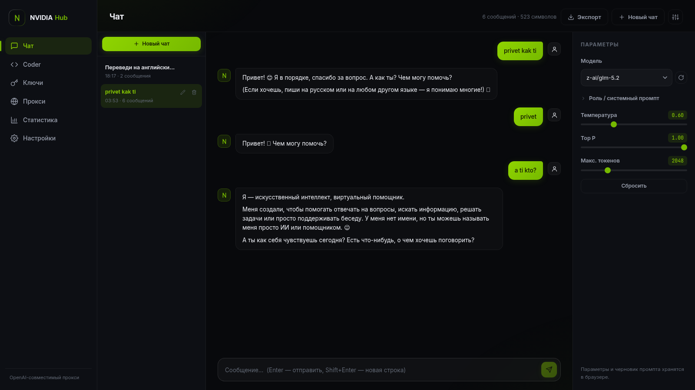
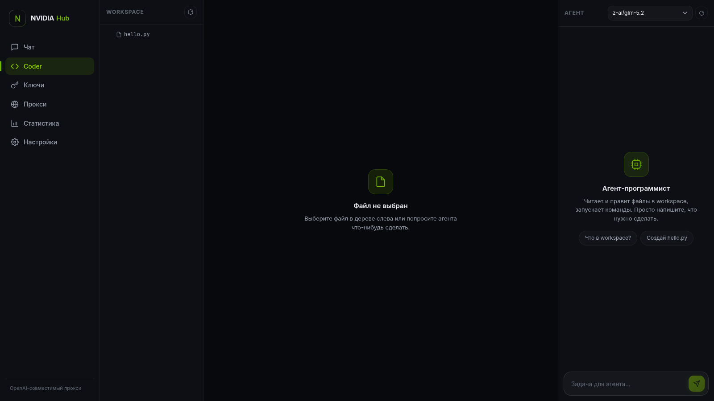
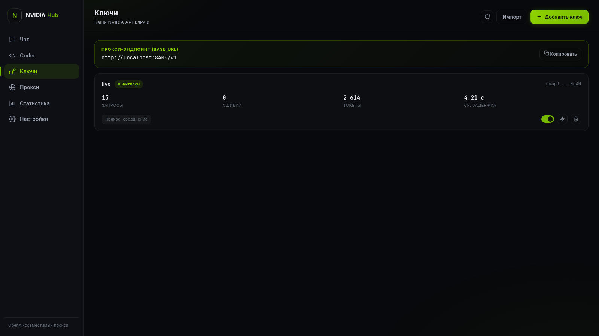
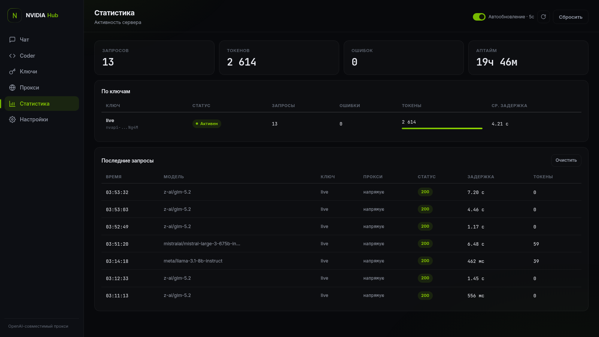

<p align="center">
  
</p>

<h1 align="center">NVIDIA Hub</h1>

<p align="center">
  <strong>OpenAI-compatible LLM gateway for NVIDIA NIM — API key pool, proxy rotation, streaming chat UI & coder IDE agent.</strong>
</p>

<p align="center">
  <a href="https://github.com/Ax1zz/nvidia-hub/blob/main/LICENSE"></a>
  
  
  
  
  <a href="https://github.com/Ax1zz/nvidia-hub/stargazers"></a>
</p>

<p align="center">
  <a href="#english">🇬🇧 English</a> • <a href="#русский">🇷🇺 Русский</a>
</p>

---

<a id="english"></a>

## 🔑 What is NVIDIA Hub?

**NVIDIA Hub** turns a pile of free [NVIDIA NIM](https://build.nvidia.com) API keys into one reliable, self-hosted **OpenAI-compatible gateway**. Drop in your keys, point any OpenAI client (Codex CLI, Continue, LangChain, your own scripts) at `http://localhost:8400/v1` — and the hub load-balances requests across the whole key pool, rotates HTTP/SOCKS5 proxies, retries failures and cools down rate-limited keys automatically. On top of that you get a slick dark **chat UI** with streaming and a built-in **coder IDE agent** that reads/writes files and runs shell commands via function calling.

No `.env` files, no YAML — everything is configured from the web interface.

### ✨ Features

- **🔑 API key pool** — add keys one by one or bulk-import a list; **round-robin** or **least-used** strategy; automatic cooldown on `401/429`; per-key stats (requests, errors, tokens, avg latency).
- **🌐 Proxy rotation** — attach multiple `http`/`socks5` proxies to each key; per-request rotation; dead proxies are evicted automatically.
- **🔌 OpenAI-compatible endpoint** — `POST /v1/chat/completions` (streaming + non-streaming) and `GET /v1/models`. Any API key string works on the client side — the hub substitutes real keys from the pool.
- **💬 Chat UI** — token streaming, markdown with code highlighting, generation controls (temperature, top_p, max tokens), system prompt, multiple chats, export, stop generation at any moment.
- **🧑‍💻 Coder IDE agent** — workspace file manager + code editor + agent with function calling (read/write files, run commands) and live tool-call visualization.
- **📊 Live statistics** — per-key usage, recent requests log with model/latency/status, uptime, auto-refresh.
- **🖥️ One-file config** — `data/config.json` is created automatically; change everything from the UI.

### 📸 Screenshots

<p align="center">
  
  
</p>
<p align="center">
  
  
</p>

### 📦 Download prebuilt binaries — no Python needed

Grab the ready-made standalone build from [**Releases**](https://github.com/Ax1zz/nvidia-hub/releases/latest):

- **Windows:** `nvidia-hub-windows.exe` — double-click, done
- **Linux:** `nvidia-hub-linux` — `chmod +x nvidia-hub-linux && ./nvidia-hub-linux`

Then open **http://localhost:8400**. Keys and settings are stored in `data/` next to the binary. Set `PORT` env var to change the port.

### 🚀 Quick start (from source)

Requirements: **Python 3.10+**

```bash
git clone https://github.com/Ax1zz/nvidia-hub.git
cd nvidia-hub
python3 -m venv venv
venv/bin/pip install -r requirements.txt
venv/bin/python -m app.main
```

Open **http://localhost:8400** → *Ключи / Keys* → add your NVIDIA API keys ([get one free at build.nvidia.com](https://build.nvidia.com)) → start chatting.

Custom port: `PORT=9000 venv/bin/python -m app.main`

### 🔌 Use it as an OpenAI-compatible proxy

Base URL: `http://<host>:8400/v1` — API key: any string (the hub injects real keys from the pool).

```bash
curl http://localhost:8400/v1/chat/completions \
  -H "Content-Type: application/json" \
  -d '{"model": "meta/llama-3.1-8b-instruct", "messages": [{"role":"user","content":"hi"}], "stream": true}'
```

Works out of the box with **Codex CLI**, **Continue.dev**, **OpenAI Python SDK**, **LangChain**, and any tool that accepts a custom OpenAI base URL:

```python
from openai import OpenAI
client = OpenAI(base_url="http://localhost:8400/v1", api_key="anything")
print(client.chat.completions.create(
    model="meta/llama-3.1-8b-instruct",
    messages=[{"role": "user", "content": "hello"}],
).choices[0].message.content)
```

### ⚙️ How it works

- **Key selection** — `round-robin` (по кругу) or `least-used`; keys that return `401/429` go into a configurable cooldown (`cooldown_s`, default 60s) while remaining keys absorb the traffic; up to `max_retries` transparent retries per request.
- **Proxy pool** — each key can carry several proxies; every request takes the next proxy in line, dead ones are marked and skipped. Direct connection is used when no proxies are attached.
- **Storage** — keys, proxies and settings live in `data/config.json` (created on first run; `chmod 600` on a shared host). Chats persist in `data/chats.json`.

### 🗂️ Project structure

```
nvidia-hub/
├── app/               # FastAPI backend
│   ├── main.py        # HTTP endpoints
│   ├── pool.py        # key & proxy pools, rotation, cooldowns
│   ├── upstream.py    # NVIDIA NIM upstream client
│   ├── agent.py       # coder agent (function calling)
│   ├── chats.py       # chat persistence
│   └── config.py      # config store
├── static/            # frontend SPA (vanilla JS, no build step)
├── docs/screenshots/  # UI screenshots
├── CONTRACT.md        # API contract
└── requirements.txt   # fastapi, uvicorn, httpx[socks]
```

### 🔒 Security notes

- The hub has **no authentication** — bind it to localhost or put it behind your own reverse proxy/VPN.
- `data/config.json` contains your API keys — never commit it (it is already in `.gitignore`).

### 🤝 Contributing

Issues and pull requests are welcome. If this project saved you time — **give it a ⭐**, it helps a lot.

### 📄 License

[MIT](LICENSE) © Ax1zz

---

<a id="русский"></a>

## 🔑 Что такое NVIDIA Hub?

**NVIDIA Hub** превращает пачку бесплатных API-ключей [NVIDIA NIM](https://build.nvidia.com) в один надёжный **OpenAI-совместимый шлюз** на вашей машине. Добавьте ключи, направьте любой OpenAI-клиент (Codex CLI, Continue, LangChain, свои скрипты) на `http://localhost:8400/v1` — хаб сам распределит запросы по всему пулу ключей, будет ротировать HTTP/SOCKS5-прокси, повторять неудачные запросы и отправлять «отдохнуть» ключи, словившие rate-limit. Сверху — стильный тёмный **чат** со стримингом и встроенный **coder-агент с IDE**, который читает и правит файлы и запускает команды через function calling.

Никаких `.env` и YAML — всё настраивается через веб-интерфейс.

### ✨ Возможности

- **🔑 Пул ключей** — добавление по одному или массовым импортом; стратегии **round-robin** / **least-used**; автоматический cooldown при `401/429`; статистика по каждому ключу (запросы, ошибки, токены, средняя задержка).
- **🌐 Ротация прокси** — к каждому ключу привязывается несколько прокси (`http`/`socks5`); ротация по кругу при каждом запросе; мёртвые прокси отбраковываются автоматически.
- **🔌 OpenAI-совместимый эндпоинт** — `POST /v1/chat/completions` (стриминг и обычный) и `GET /v1/models`. На клиенте подойдёт любая строка как API-ключ — хаб подставит настоящие ключи из пула.
- **💬 Чат** — стриминг ответов, markdown с подсветкой кода, настройки генерации (temperature, top_p, max tokens), системный промпт, несколько чатов, экспорт, остановка генерации в любой момент.
- **🧑‍💻 Coder IDE** — файловый менеджер workspace + редактор + агент с function calling (читает/пишет файлы, запускает команды) с живым отображением вызовов инструментов.
- **📊 Живая статистика** — использование по ключам, лог последних запросов с моделью/задержкой/статусом, аптайм, автообновление.
- **🖥️ Конфиг без ручной возни** — `data/config.json` создаётся автоматически, всё меняется из интерфейса.

### 📦 Готовые бинарники — Python не нужен

Скачайте standalone-сборку из раздела [**Releases**](https://github.com/Ax1zz/nvidia-hub/releases/latest):

- **Windows:** `nvidia-hub-windows.exe` — двойной клик, и готово
- **Linux:** `nvidia-hub-linux` — `chmod +x nvidia-hub-linux && ./nvidia-hub-linux`

Откройте **http://localhost:8400**. Ключи и настройки хранятся в папке `data/` рядом с бинарником. Порт меняется переменной окружения `PORT`.

### 🚀 Запуск (из исходников)

Требуется **Python 3.10+**

```bash
git clone https://github.com/Ax1zz/nvidia-hub.git
cd nvidia-hub
python3 -m venv venv
venv/bin/pip install -r requirements.txt
venv/bin/python -m app.main
```

Откройте **http://localhost:8400** → *Ключи* → добавьте свои NVIDIA API-ключи ([бесплатно на build.nvidia.com](https://build.nvidia.com)) → общайтесь.

Другой порт: `PORT=9000 venv/bin/python -m app.main`

### 🔌 Использование как прокси для внешних инструментов

Base URL: `http://<host>:8400/v1`, API key — любая строка (авторизация не требуется, сервер подставляет ключи из пула).

```bash
curl http://localhost:8400/v1/chat/completions \
  -H "Content-Type: application/json" \
  -d '{"model": "meta/llama-3.1-8b-instruct", "messages": [{"role":"user","content":"hi"}], "stream": true}'
```

Работает из коробки с **Codex CLI**, **Continue.dev**, **OpenAI Python SDK**, **LangChain** и любым инструментом, где можно указать свой OpenAI base URL.

### ⚙️ Как это устроено

- **Выбор ключа** — `round-robin` (по кругу) или `least-used`; ключи, ответившие `401/429`, уходят в настраиваемый cooldown (`cooldown_s`, по умолчанию 60 с), трафик подхватывают остальные; до `max_retries` прозрачных ретраев на запрос.
- **Пул прокси** — к каждому ключу можно привязать несколько прокси; каждый запрос берёт следующий по кругу, мёртвые помечаются и пропускаются. Без прокси — прямое соединение.
- **Хранилище** — ключи, прокси и настройки лежат в `data/config.json` (создаётся при первом запуске; на общем хосте сделайте `chmod 600`). Чаты — в `data/chats.json`.

### 🔒 Безопасность

- У хаба **нет авторизации** — вешайте на localhost или прячьте за свой reverse proxy/VPN.
- `data/config.json` содержит ваши ключи — не коммитьте его (он уже в `.gitignore`).

### 🤝 Участие в проекте

Issues и pull request'ы приветствуются. Если проект сэкономил вам время — **поставьте ⭐**, это очень помогает.

### 📄 Лицензия

[MIT](LICENSE) © Ax1zz
